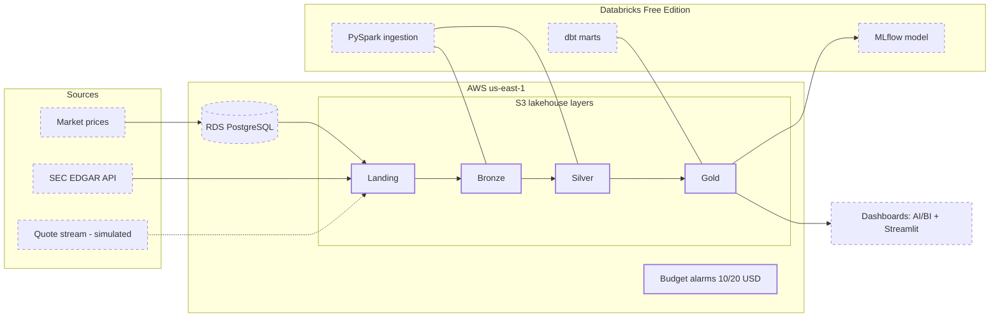

# edgar-lakehouse

An end-to-end lakehouse on SEC EDGAR filings and market data. It runs on AWS and
Terraform, with Databricks (Delta Lake, Unity Catalog), PySpark, dbt, and Airflow,
and covers batch and streaming ingestion, data-quality checks, ML models,
and dashboards. Built in public, delivery by delivery.

## Project status

**D02, Terraform foundation** (in progress) — remote state with native S3
locking, the four lakehouse layer buckets, and budget alarms provisioned
before any billable resource. D01 (scaffolding & engineering standards) is
merged.

## Why this project

SEC EDGAR is regulatory-grade financial data, and it shows up in three shapes that
really are different: structured market prices, semi-structured XBRL facts, and
unstructured filing text. A tidy CSV would hide the problems worth solving. This
spread does the opposite and puts them in front of you: schema evolution,
late-arriving data, entity resolution across sources. Everything rebuilds from
`terraform apply` and a clone of this repo, infrastructure and pipelines and tests
and dashboards included. Every non-obvious decision goes into an ADR the moment it
gets made.

## Architecture

Full diagram and notes live in [docs/architecture.md](docs/architecture.md);
decisions are recorded as [ADRs](docs/adr/). Solid nodes exist, dashed ones
are planned:

## Cost guardrails

This project runs on a hard US$30 ceiling. Controls, in order of usefulness:
ephemeral infrastructure (`terraform destroy` recreates everything in
minutes), an explicit stop/destroy checkpoint closing every delivery, and
two AWS Budgets alarms (US$10 / US$20) provisioned as code in
[`infra/foundation`](infra/foundation) - armed before the first billable
resource existed. Budget data lags by up to a day; the alarms are
tripwires, not brakes.

## Roadmap

Work ships in small, verifiable deliveries. Each one lands through a reviewed PR
with green CI:

| Phase | Scope |
|---|---|
| Foundations | Repo scaffolding, engineering standards, AWS + Terraform bootstrap |
| Ingestion | EDGAR and market-data clients, Postgres source, streaming quote replay |
| Lakehouse | Bronze and Silver layers on Delta Lake (PySpark on Databricks) |
| Modeling | Gold layer with dbt, data-quality suites |
| ML & serving | Feature building, one tracked model with MLflow |
| Orchestration & UX | Airflow DAGs, Streamlit dashboards |

## License

[MIT](LICENSE)
