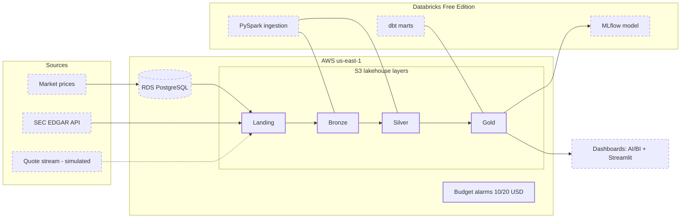

# Architecture

Target architecture as of D02. Solid nodes exist; dashed nodes are planned.
The diagram is Mermaid source, versioned with the code — each delivery that
changes the system changes this file in the same PR.

Infrastructure state: Terraform, remote state on S3 with native lockfile
locking ([ADR-002](adr/0002-remote-state-locking-and-iam-stance.md)). The
lakehouse buckets, the budget alarms and the state backend were provisioned
in D02; everything downstream of landing arrives in later deliveries.
